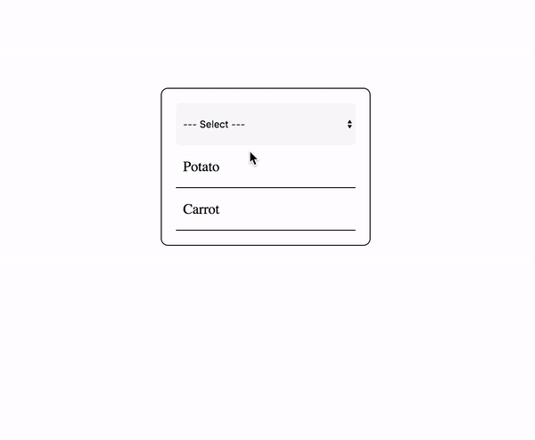

# Not Just One
> HTML item selector that supports multiple items.

> 
> <i>Built in Gothenburg using coffee, love and Vanilla Javascript</i>

## Example:
> How to implement and use:
> [index.html](index.html)
